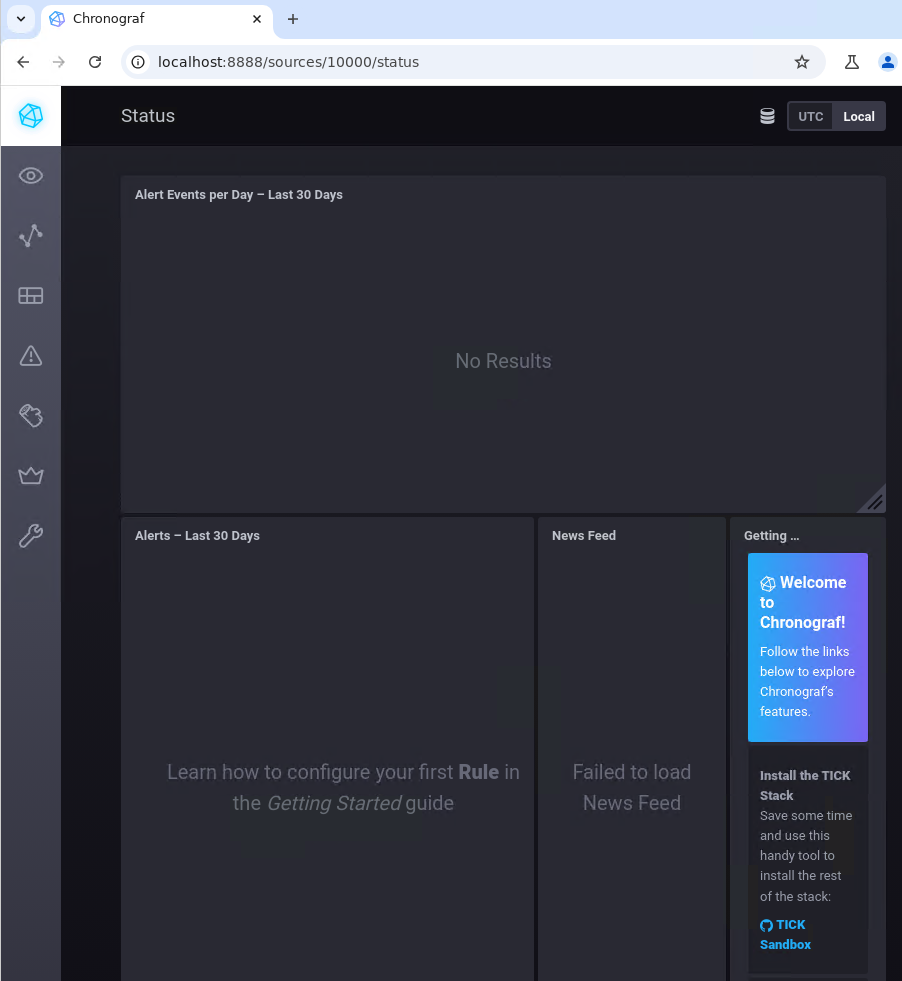
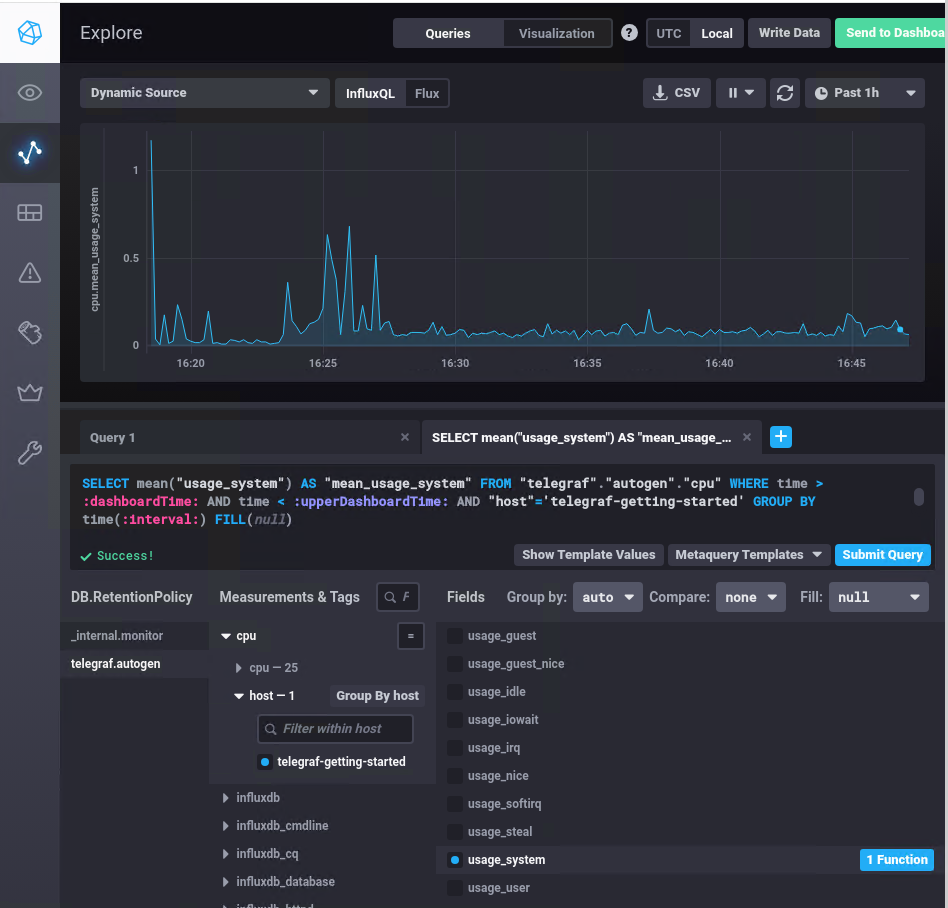
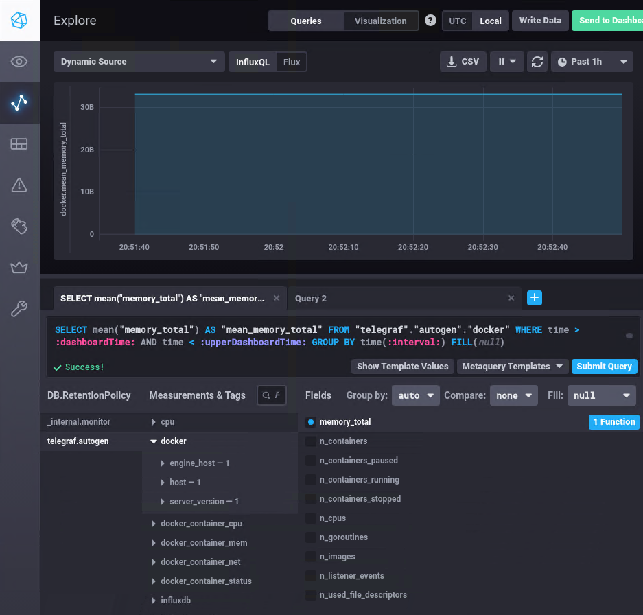

# Домашнее задание к занятию "13.Системы мониторинга" Крюков Николай Сергеевич

## Обязательные задания

1. Вас пригласили настроить мониторинг на проект. На онбординге вам рассказали, что проект представляет из себя 
платформу для вычислений с выдачей текстовых отчетов, которые сохраняются на диск. Взаимодействие с платформой 
осуществляется по протоколу http. Также вам отметили, что вычисления загружают ЦПУ. Какой минимальный набор метрик вы
выведите в мониторинг и почему?

#### Решение

Опираясь на приведенные наборы метрик, следует мониторить:

Latency - время отклика HTTP-запросов пользователей, а также задержку read/write операций на диске.
Traffic - количество запросов к компоненту. Для веб-сервера это могут http-запросы, для базы данных — транзакции и т.д.
Errors - частоту ошибок или количество ошибок. Это могут быть некорректные коды ответа, исключения в приложении и т.д.
Utilization - время или процент использования ресурса, занятого «полезной работой» (CPU, RAM, HDD, FS, inodes), чтобы отслеживать состояние дисков и нагрузку на ЦПУ и другие ресурсы при вычислениях.
Saturation - вводится для ситуации, когда utilization 100 % и работа откладывается в очередь. Например, большое количество http-запросов единовременно, отложенные вычисления в БД.

#


2. Менеджер продукта посмотрев на ваши метрики сказал, что ему непонятно что такое RAM/inodes/CPUla. Также он сказал, 
что хочет понимать, насколько мы выполняем свои обязанности перед клиентами и какое качество обслуживания. Что вы 
можете ему предложить?


#### Решение

Когда менеджер продукта говорит, что хочет понять, насколько команда выполняет свои обязанности перед клиентами
 и какое качество обслуживания, то ему можно предложить следующее:


- **SLI (Service level indicators)** - индикатор качества обслуживания набор ключевых метрик, по которым можно определить жизненный статус сервиса, его производительность, «удовлетворенность» конечных пользователей работой сервиса.
- **SLA (Service level agreement)** -  соглашение об уровне обслуживания которое определяется как внешнее обязательство перед конечным пользователем или клиентом.
- **SLO (Service level objectives)** - целевой уровень качества обслуживания


#

3. Вашей DevOps команде в этом году не выделили финансирование на построение системы сбора логов. Разработчики в свою 
очередь хотят видеть все ошибки, которые выдают их приложения. Какое решение вы можете предпринять в этой ситуации, 
чтобы разработчики получали ошибки приложения?


#### Решение

Большинство операционных систем Linux имеют встроенные механизмы для отправки системных и приложенческих логов
через rsyslog или syslog. Вы можете настроить эти инструменты для отправки логов приложений в определённый файл,
который разработчики могут просматривать.


#

4. Вы, как опытный SRE, сделали мониторинг, куда вывели отображения выполнения SLA=99% по http кодам ответов. 
Вычисляете этот параметр по следующей формуле: summ_2xx_requests/summ_all_requests. Данный параметр не поднимается выше 
70%, но при этом в вашей системе нет кодов ответа 5xx и 4xx. Где у вас ошибка?


#### Решение

Ошибка заключается в том, что формула для расчета SLA использует только коды 2xx (успешные запросы) и все запросы
(summ_all_requests), но игнорирует другие возможные коды ответов, такие как 3xx (редиректы), которые также
считаются успешными, но не попадают в диапазон 2xx.

#

5. Опишите основные плюсы и минусы pull и push систем мониторинга.


#### Решение
- Pull model
  - Плюсы
    - Можно вытянуть всё, что нужно, одним пакетом, не создавая нагрузки на трафик. Опрашиваем только тех агентов, которые нам нужны (и которым мы доверяем). Запрашиваем только то, что нужно.
  - Минусы
    - Сложно поддерживать реплику. Сложно опрашивать большое число систем. При низкой частоте опроса данные могут быть устаревшими.
- Push model
  - Плюсы
    - Можно раскидывать данные сразу в несколько систем мониторинга (и их метрики). Не нужно опрашивать всех, данные придут сами. Данные приходят чаще, а потому могут быть актуальнее.
  - Минусы
    - Нагрузка на сеть за счёт частоты отправки. Отправляется всё подряд.Если система мониторинга отвалилась, отправленные данные могут быть утеряны.

#

6. Какие из ниже перечисленных систем относятся к push модели, а какие к pull? А может есть гибридные?

    - Prometheus 
    - TICK
    - Zabbix
    - VictoriaMetrics
    - Nagios

#### Решение

    - к push модели относится TICK.
    - к pull модели относится Nagios
    - Prometheus, Zabbix и VictoriaMetrics могут относиться к обеим модулем, в зависимости от схемы мониторинга.


#

7. Склонируйте себе [репозиторий](https://github.com/influxdata/sandbox/tree/master) и запустите TICK-стэк, 
используя технологии docker и docker-compose.

В виде решения на это упражнение приведите скриншот веб-интерфейса ПО chronograf (`http://localhost:8888`). 

P.S.: если при запуске некоторые контейнеры будут падать с ошибкой - проставьте им режим `Z`, например
`./data:/var/lib:Z`

#### Решение

Скриншот первой страницы



#

8. Перейдите в веб-интерфейс Chronograf (http://localhost:8888) и откройте вкладку Data explorer.
        
    - Нажмите на кнопку Add a query
    - Изучите вывод интерфейса и выберите БД telegraf.autogen
    - В `measurments` выберите cpu->host->telegraf-getting-started, а в `fields` выберите usage_system. Внизу появится график утилизации cpu.
    - Вверху вы можете увидеть запрос, аналогичный SQL-синтаксису. Поэкспериментируйте с запросом, попробуйте изменить группировку и интервал наблюдений.

Для выполнения задания приведите скриншот с отображением метрик утилизации cpu из веб-интерфейса.

#### Решение

Скриншот с отображением метрик утилизации cpu из веб-интерфейса



#


9. Изучите список [telegraf inputs](https://github.com/influxdata/telegraf/tree/master/plugins/inputs). 
Добавьте в конфигурацию telegraf следующий плагин - [docker](https://github.com/influxdata/telegraf/tree/master/plugins/inputs/docker):
```
[[inputs.docker]]
  endpoint = "unix:///var/run/docker.sock"
```

Дополнительно вам может потребоваться донастройка контейнера telegraf в `docker-compose.yml` дополнительного volume и 
режима privileged:
```
  telegraf:
    image: telegraf:1.4.0
    privileged: true
    volumes:
      - ./etc/telegraf.conf:/etc/telegraf/telegraf.conf:Z
      - /var/run/docker.sock:/var/run/docker.sock:Z
    links:
      - influxdb
    ports:
      - "8092:8092/udp"
      - "8094:8094"
      - "8125:8125/udp"
```

После настройке перезапустите telegraf, обновите веб интерфейс и приведите скриншотом список `measurments` в 
веб-интерфейсе базы telegraf.autogen . Там должны появиться метрики, связанные с docker.

Факультативно можете изучить какие метрики собирает telegraf после выполнения данного задания.


#### Решение

Скриншот список measurments в веб-интерфейсе базы telegraf.autogen c метриками, связанными с docker



#


